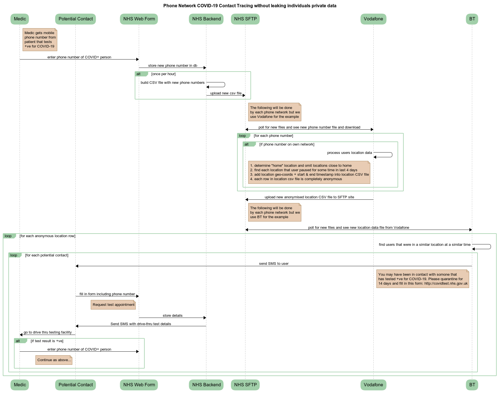

## note: may not actually be possible due to phone networks inability to pin point persons location

## A relatively simple contact tracing strategy for phone networks in conjunction with local government that protects individual privacy

1) Covid+ patient tests +ve, medic gets consent to use phone location data and fills in web form
2) Hourly (or at worst daily) the phone numbers of newly +ve diagnosed are sent to the cellphone operators
3) Cellphone network processes the location data for each new number (that is on their own network) into an anonymised standard form.. just a list of geo-coords+timestamp (outside the home) where a user was stationary for a period of time during the past 3/4 days
4) Hourly (or at worst daily) the cellphone networks swap their new anonymised data files with each other
5) Each cellphone network processes the files from themselves and the other operators to find potential contacts from all of their users location data for the last 3/4 days
6) For each potential contact they send out an SMS: “You may have been in contact with someone that has recently tested positive for COVID-19 please quarantine with anyone else in your home for 14 days and also fill out this web form: <link to webform>
7) Potential contact fills out web form to enter contact details and request a test appointment
8) Potential contact is sent an SMS or email with location and time of test appointment
9) Potential contact visits testing facility and has a test performed
10) Continue from the start.. if the test is +ve

## Notes
* It would be best if the web form was branded for the most trustworthy government backed body in the country (i.e. NHS for the UK).

* Of course the very same web form could be used to request an anti-body test for other reasons (e.g. have symptoms, was with someone that has tested +ve, etc)

## Why Apps won't work
Lots of people seem to be going the app route but it's extremely difficult to get people to install and use any arbitrary app especially as the app doesn't really give the user any utility and it also drains the battery quickly.

